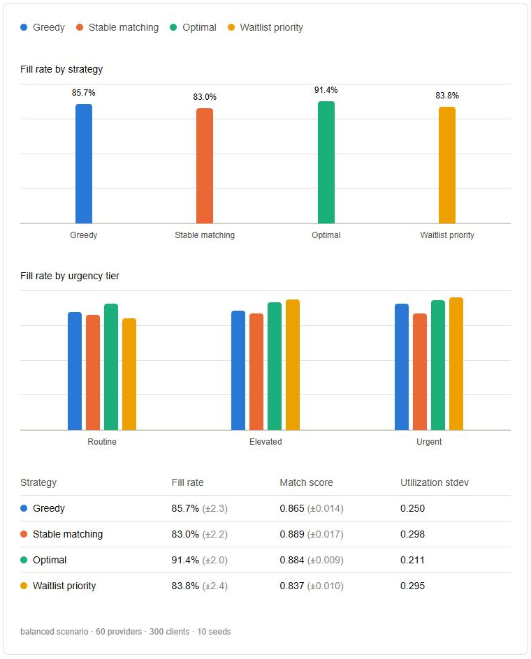

# Care Match

A therapist-client matching and waitlist optimization engine: an original take on the hardest problem underneath any telehealth marketplace, which is pairing a client with the right available provider, fast, without a licensure, insurance-panel, or capacity constraint silently producing a bad match.

**The headline result.** Four matching strategies run against identical synthetic populations (60 providers, 300 clients, 10 seeds). Optimal assignment serves the most clients (91.4%) and balances provider load best, but only one strategy, waitlist priority, lets clinical urgency change who gets served: it fills 95.5% of urgent clients versus 80.3% of routine ones, a 15.2-point gap, while the other three show gaps of 1 to 6 points that are incidental, since they never look at urgency at all. Every number is reproducible from a seed. Full results and the tradeoffs behind them are in [Results](#results).

<picture>
  <source media="(prefers-color-scheme: dark)" srcset="docs/comparison-dark.png">
  
</picture>

Two pages in the Next.js app make this explorable: `/comparisons` runs the comparison with your own scenario, seed count, and population size, and `/intake` submits a client against a provider pool and shows their ranked candidates.

## Why this exists

Telehealth marketplaces all sit on top of the same hard problem: providers are a constrained, unevenly distributed resource (licensed only in certain states, paneled with only certain insurers, with a hard weekly capacity), and clients arrive with a mix of hard constraints (insurance, state, timezone) and soft preferences (specialty, modality, language, cultural fit). Naive filter-and-pick-first matching ignores marketplace-level effects: some providers get overloaded while others sit idle, and clients wait longer than they need to.

This project treats matching as a two-sided marketplace optimization problem rather than a lookup query. It builds a synthetic provider/client marketplace and compares four matching strategies against the same simulated demand: greedy first-come-first-served, batch stable matching, globally optimal assignment, and a waitlist strategy that admits by urgency and time waited. They are evaluated on fill rate, match quality, provider utilization balance, and fill rate by urgency tier.

This is a portfolio project built on synthetic data. It isn't modeled on, or affiliated with, any specific company's internal systems.

## What's built

- [x] Synthetic provider/client data generator (state, insurance panel, specialty, capacity, preferences)
- [x] Matching engine v1: hard-constraint filtering + weighted scoring (`GET /api/v1/clients/{id}/candidates`)
- [x] Strategy comparison: greedy vs. batch stable matching (Gale-Shapley-style) vs. optimal assignment
  - [x] Greedy (`POST /api/v1/simulation-runs/{id}/strategies/greedy`): first-come-first-served by arrival order, no lookahead
  - [x] Batch stable matching (`POST /api/v1/simulation-runs/{id}/strategies/stable-matching`): client-proposing Gale-Shapley, providers rank clients by the same mutual fit score
  - [x] Optimal assignment (`POST /api/v1/simulation-runs/{id}/strategies/optimal`): Hungarian algorithm (scipy) maximizing total match score across the whole batch
- [x] Comparison harness + evaluation metrics (`POST /api/v1/comparisons`): runs every strategy against the same population per seed; reports fill rate, provider utilization variance, and fill rate by urgency tier, with mean/stdev across seeds.
- [x] Waitlist optimization (`POST /api/v1/simulation-runs/{id}/strategies/waitlist-priority`): a fourth strategy that simulates clients arriving over the run's horizon instead of treating the population as known up front; providers admit by priority (urgency plus days waited) rather than fit score, bumping a lower-priority holder when a higher-priority proposal arrives
- [x] Client intake + admin/ops dashboards (Next.js): `/comparisons` turns the Results table above into an interactive, chart-driven comparison; `/intake` submits a client against an existing simulation run's provider pool and shows ranked candidates

## Domain model

Entities as they land, each with a SQLAlchemy model, Alembic migration, Pydantic schema, and CRUD routes:

- [x] `Provider` (`/api/v1/providers`): license states, specialties, modalities, languages, insurance panels, weekly capacity
- [x] `Client` (`/api/v1/clients`): state, insurance payer, needed specialties, preferred modality/language, urgency
- [x] `WaitlistEntry` (`/api/v1/waitlist-entries`): records a client's path through the waitlist strategy (waiting, matched, or expired) with a resolution timestamp
- [x] `Match` (`/api/v1/matches`): a client/provider pairing, tagged with the strategy that produced it
- [x] `SimulationRun` (`/api/v1/simulation-runs`): groups one experiment (scenario, seed, and population size) so different strategies can be compared against the same synthetic population; clients and providers link to a run via `simulation_run_id`

## Synthetic data assumptions

The generator's distributions are anchored to public data where any exists and flagged as assumptions where it doesn't. Every weight lives in `backend/app/simulation/config.py`.

Anchored to public data:

- State demand shares follow the [Census 2025 population estimates](https://www.census.gov/newsroom/press-releases/2026/population-growth-slows.html) for the eight modeled states.
- Spanish-speaking provider supply (5.5%) follows [APA workforce data](https://www.apa.org/monitor/2018/06/spanish-speaking), set against a much larger Spanish-preferring client share.
- Medicaid scarcity (roughly 17% of psychotherapists accept any public insurance) follows a [Georgia study](https://pmc.ncbi.nlm.nih.gov/articles/PMC11708982/). It covers one state, so it is a directional anchor rather than a national figure.
- Payer demand ordering (Blue Cross plans largest, then UnitedHealthcare) follows [insurer market share reporting](https://medwave.io/2025/12/directory-health-insurance-companies/). The exact shares are estimates.

Trauma demand is set so about 58% of clients list trauma among their needs, in line with a practitioner-reported estimate that 50 to 70% of active caseloads involve underlying trauma even when it is not the presenting issue. Public research supports high trauma prevalence among outpatient mental health clients ([Psychiatric Services](https://psychiatryonline.org/doi/10.1176/appi.ps.55.2.157), [Annals of General Psychiatry](https://annals-general-psychiatry.biomedcentral.com/articles/10.1186/s12991-019-0239-1)), but no exact caseload figure was found.

Assumptions with no public source found: the remaining specialty demand and supply shares, provider modality mix, and urgency mix.

## Results

From `POST /api/v1/comparisons` with the balanced scenario, 60 providers, 300 clients, averaged across 10 seeds (standard deviation in parentheses):

| Strategy | Mean fill rate | Mean match score | Mean provider utilization stdev | Fill rate: routine / elevated / urgent |
|---|---|---|---|---|
| Greedy | 85.7% (2.3%) | 0.865 (0.014) | 0.250 | 85.0% / 86.1% / 91.0% |
| Stable matching | 83.0% (2.2%) | 0.889 (0.017) | 0.298 | 82.7% / 83.7% / 83.8% |
| Optimal | 91.4% (2.0%) | 0.884 (0.009) | 0.211 | 91.1% / 91.9% / 93.7% |
| Waitlist priority | 83.8% (2.4%) | 0.837 (0.010) | 0.295 | 80.3% / 93.8% / 95.5% |

No strategy wins outright, each optimizes for something different:

- Optimal serves the most clients overall and spreads load most evenly across providers, by accepting some lower-quality matches that greedy and stable matching leave on the table entirely rather than making at all.
- Stable matching produces the best average match quality, at the cost of serving fewer clients and concentrating good matches on the providers everyone already prefers, the highest utilization variance of the first three.
- Greedy sits in between on every measure and needs no knowledge of the rest of the population to run, unlike the other three, which require the whole batch (or at least its arrival schedule) up front.
- Waitlist priority is the only strategy where urgency actually changes outcomes. The other three score matches on specialty, language, and modality alone, never on `Client.urgency`, so their routine-to-urgent fill gap (6.0, 1.1, and 2.6 points) is incidental, not causal. Waitlist priority's gap is 15.2 points, bought by driving routine fill below every other strategy's: it is explicitly trading overall fill and average match quality for getting urgent and long-waiting clients served first.

Only waitlist priority simulates clients arriving over time rather than treating the whole population as known up front, which is also the only reason `fill_rate_by_urgency` differs meaningfully between strategies: the other three have no mechanism that could respond to urgency even if they wanted to.

Specialty fit is a soft score, not an eligibility constraint. Only state licensure and payer paneling decide who can serve whom. A scarce specialty therefore shows up as lower match quality rather than more unserved clients, and the population summary reports it as `mean_best_specialty_fit`.

The table above is reproducible, not incidental: every strategy's client and provider queries tie-break on `name` rather than `created_at`. All rows in one bulk insert share the same transaction timestamp, so ordering by `created_at` alone let Postgres return ties in a different order on different queries, producing slightly different outcomes from the same seed. A regression test generates two separate populations from the same seed and checks every strategy returns an identical summary for both.

The demand to capacity ratio of 1.0 was chosen empirically. Sweeping it from 0.7 to 1.25 on generated populations, the gap between a naive greedy pass and the best possible assignment peaked at 1.0 (about 7 points of clients served for first-fit greedy, 3 for a most-room greedy), so that is where the choice of strategy matters most.

## Stack

- **Frontend**: Next.js (App Router), TypeScript, Tailwind CSS, ESLint, pnpm
- **Backend**: FastAPI, SQLAlchemy 2.0, Alembic migrations, Pydantic Settings, uv, pytest, ruff, mypy
- **Database**: PostgreSQL (via Docker Compose for local dev)
- **CI**: GitHub Actions, lints, type-checks, builds, and tests both halves on every push/PR

## Prerequisites

- [Node.js](https://nodejs.org/) 22+ and [pnpm](https://pnpm.io/) (`corepack enable` or `npm i -g pnpm`)
- [Python](https://www.python.org/) 3.12+ and [uv](https://docs.astral.sh/uv/)
- [Docker](https://www.docker.com/) (for the local Postgres container)

## Getting started

### 1. Database

```bash
docker compose up -d
```

Starts Postgres on `localhost:5433` (user/password/db: `postgres`/`postgres`/`app`). Mapped to 5433 instead of the default 5432 to avoid clashing with any native Postgres install already running on this machine.

### 2. Backend

```bash
cd backend && cp .env.example .env && cd ..
./scripts/dev-backend.sh
```

Runs `uv sync`, applies migrations, and starts the API at `http://localhost:8000` (interactive docs at `/docs`).

### 3. Frontend

```bash
cd frontend && cp .env.example .env && cd ..
./scripts/dev-frontend.sh
```

Installs dependencies and starts the app at `http://localhost:3000`, calling the backend via `NEXT_PUBLIC_API_URL`.

## Project layout

```
.
├── frontend/           # Next.js app
│   └── src/
│       ├── app/        # App Router pages
│       └── lib/        # API client, shared utilities
├── backend/            # FastAPI app
│   ├── app/
│   │   ├── api/        # Routers
│   │   ├── core/       # Settings/config
│   │   ├── db/         # Engine, session, declarative base
│   │   ├── evaluation/ # Multi-seed strategy comparison harness
│   │   ├── matching/   # Eligibility, scoring, and the three strategies
│   │   ├── models/     # SQLAlchemy models
│   │   ├── schemas/    # Pydantic schemas
│   │   └── simulation/ # Synthetic population generator and scenarios
│   ├── alembic/        # DB migrations
│   └── tests/
├── docker-compose.yml  # Local Postgres
├── scripts/            # dev-backend / dev-frontend one-shot launch scripts
└── .github/workflows/  # CI
```

## Common tasks

| Task | Command |
|---|---|
| New DB migration | `cd backend && uv run alembic revision --autogenerate -m "message"` |
| Apply migrations | `cd backend && uv run alembic upgrade head` |
| Run backend tests | `cd backend && uv run pytest` |
| Lint backend | `cd backend && uv run ruff check .` |
| Type-check backend | `cd backend && uv run mypy app` |
| Lint frontend | `cd frontend && pnpm lint` |
| Build frontend | `cd frontend && pnpm build` |
